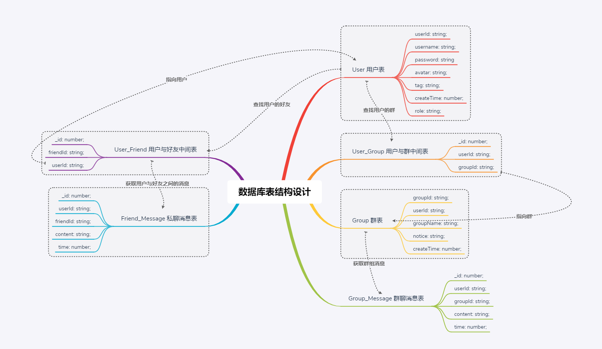

### 项目简介
  😛 闲暇时间想做一个聊天室复盘一下这些年学习到的技术,于是在2020年6月24号就开始了Genal聊天室的开发之旅.<br>
  😈 项目采用全typescript开发,这是为了以后的功能迭代打基础.当然,我本身也是很喜欢typescript的.<br>
  🧐 目前聊天室的功能还处于比较简单的阶段,今后会陆续开发很多酷炫的功能,喜欢的朋友给个star鼓励一下我吧!<br>

### 项目界面


### 项目技术
```
前端: vue + vue-router + vuex + socket.io + typescript + antd

后端: nestjs + nestjs/websocket + typescript 
```

### 数据库表结构设计


### 功能介绍
- 更改用户名/头像上传
- 群聊/私聊
- 新增群/加入群聊/模糊搜索群
- 添加好友/模糊搜索好友
- 表情包
- 消息分页

### 环境配置
- 数据库mysql 以及 chat数据库
- node v10.16.3

### 运行项目
前端项目
```js
cd genal-chat-client 
npm run serve
```
后端项目
```js
cd genal-chat-server
npm run start:dev
```

### 系统迭代记录
#### v1.0.0
##### 功能
- 新增用户
- 新增群
- 群聊
##### v1.0.0界面


#### v2.0.0
##### 功能
- 更改用户名/头像上传
- 群聊/私聊
- 新增群/加入群聊/模糊搜索群
- 添加好友/模糊搜索好友
- 表情包
- 消息分页
##### v2.0.0界面


### 作者
github: [edison](https://github.com/genaller)
