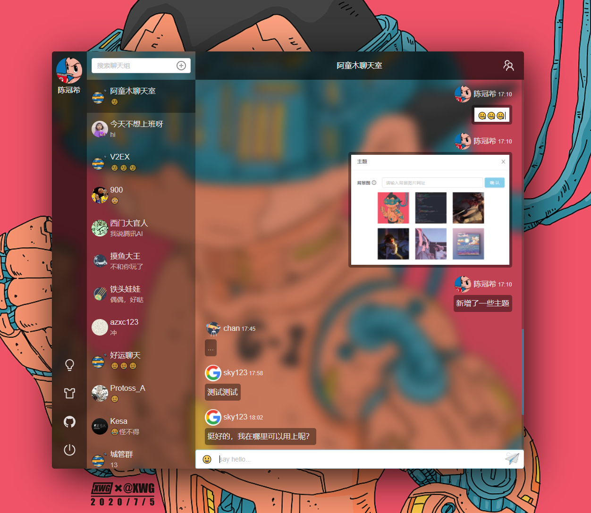
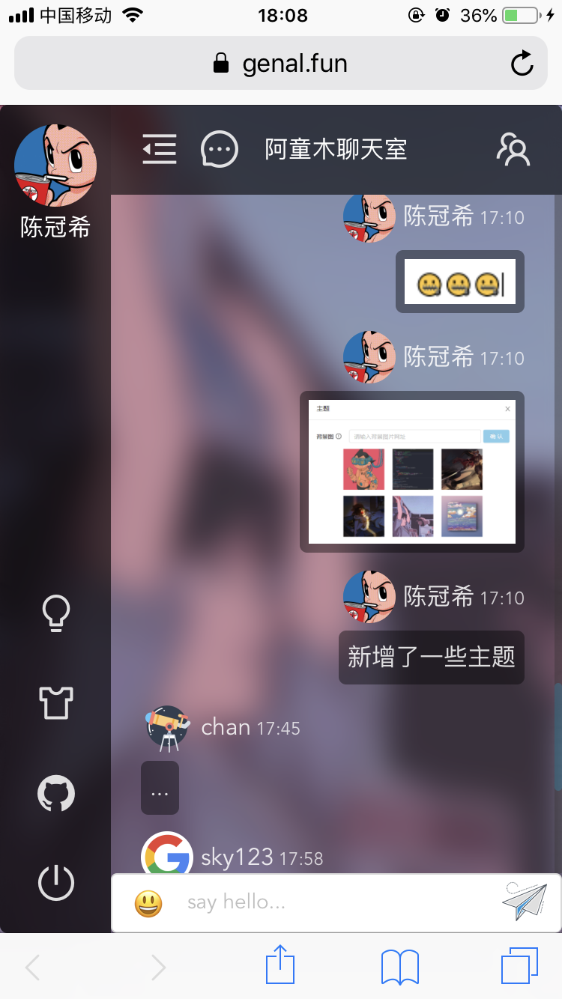
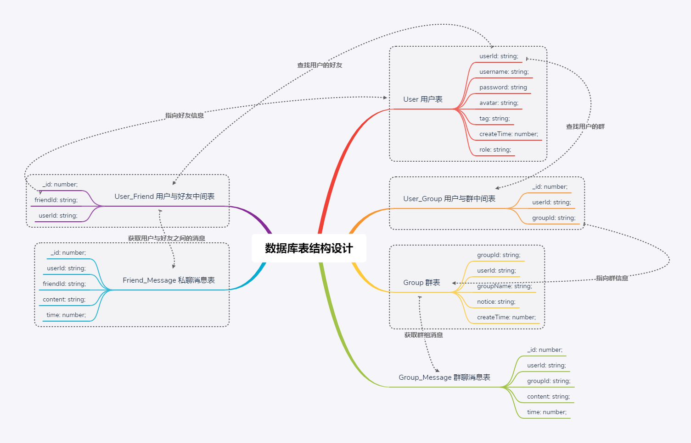
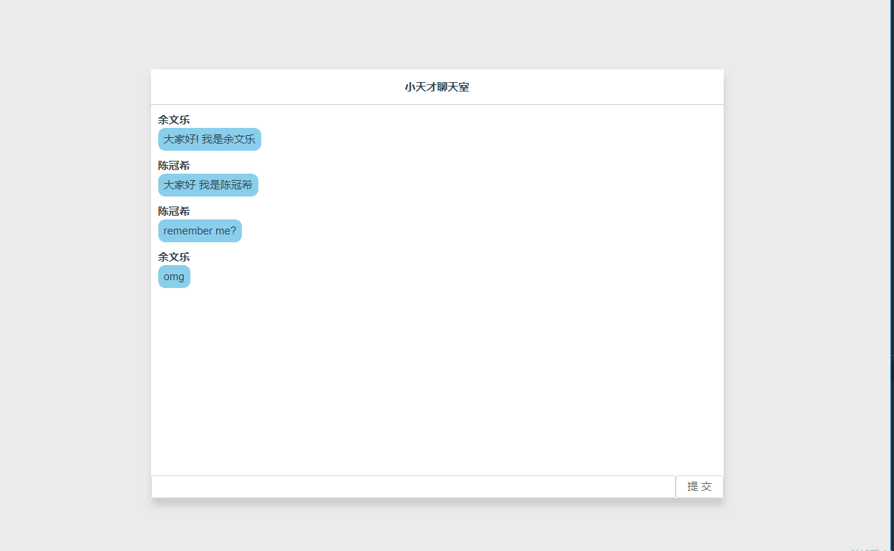
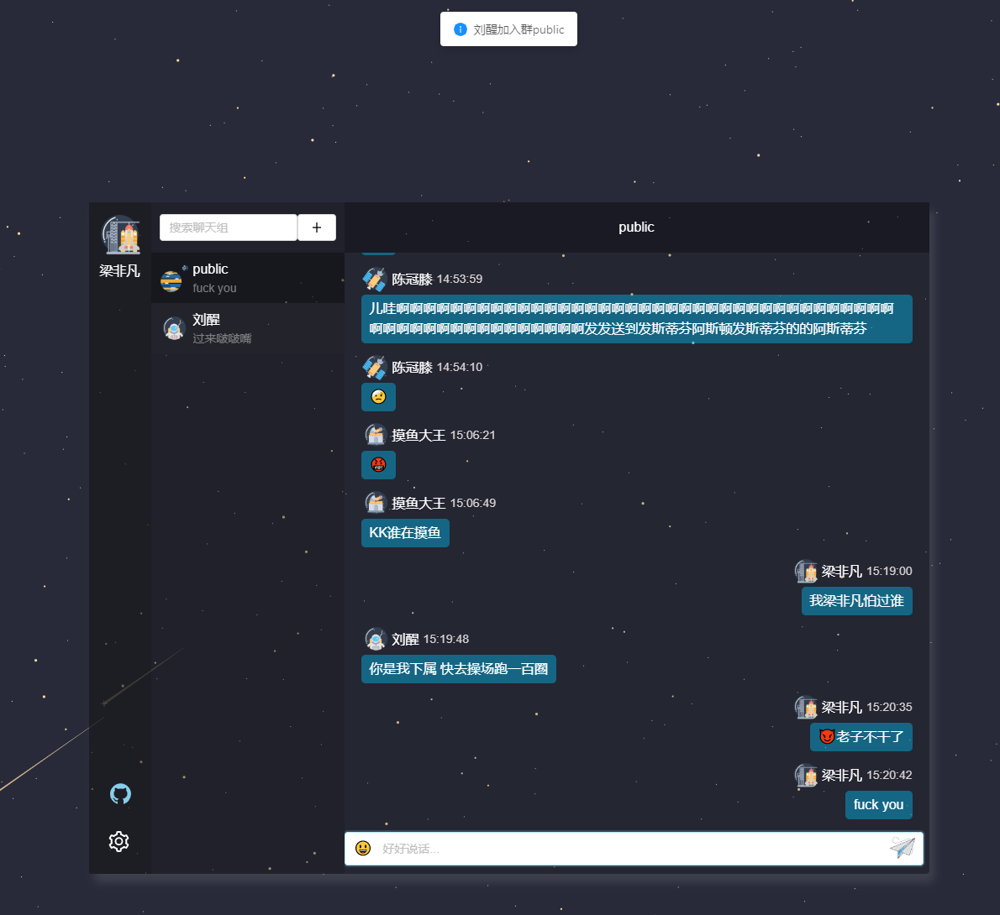
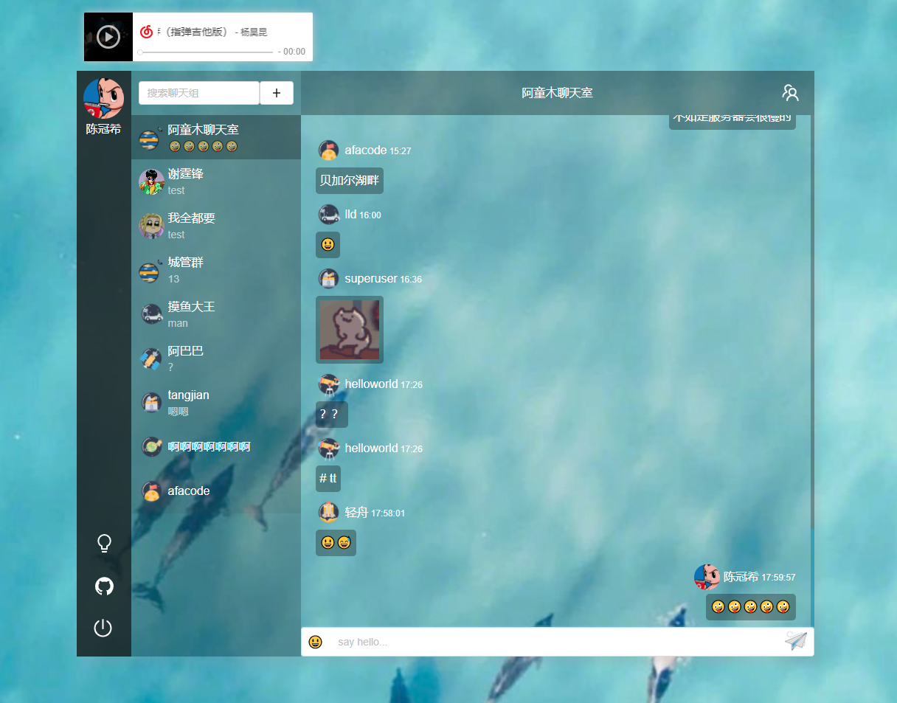

# 阿童木聊天室
[](https://github.com/genaller)
[](https://github.com/genaller/genal-chat)
[](http://nodejs.org/download)
[](https://github.com/genaller/genal-chat/blob/master/LICENSE)
[](https://github.com/genaller/genal-chat)

> [码云](https://gitee.com/edison_dec/genal-chat)<br>
>
> 在线地址[www.genal.fun](http://www.genal.fun)<br>
>
> 有建议请到issues区

### 项目简介
  😛 闲暇时间想做一个聊天室来巩固前端技能，于是在2020年6月24号就开始了阿童木聊天室的开发之旅。<br>
  😈 项目采用全typescript开发，这是为了以后的功能迭代打基础。当然，我本身也是很喜欢typescript的。<br>
  🧐 目前聊天室已经具备完整的聊天功能，今后会陆续开发更多酷炫的功能，喜欢的朋友给个star鼓励一下我吧!<br>

### 项目界面
#### PC端


#### 移动端
<p align="center">
  
</p>

### 功能介绍
- 移动端兼容
- 用户信息的修改(头像/用户名/密码)
- 群聊/私聊
- 创建群/加入群/退群/模糊搜索群
- 添加好友/删好友/模糊搜索用户
- 消息分页
- 表情包
- 图片发送/图片预览
- 在线人数统计
- 自定义主题
- 重连提醒


### 技术概览
- **Typescript**：JavaScript 的一个超集，它最大的优势是提供了类型系统和提高了代码的可读性和可维护性。
- **Vue2.6.x**：前端渐进式框架。
- **Socket/io**：实现实时通信，websocket第三方库。
- **Vuex**：专为 Vue.js 应用程序开发的状态管理模式。
- **Nestjs**：是一个用于构建高效、可扩展的 Node.js 服务端应用框架，基于 TypeScript 编写并且结合了 OOP1、FP2、FRP3 的相关理念。
- **Typeorm**: 支持最新的 JavaScript 特性并提供额外的特性以帮助你开发任何使用数据库的应用程序。
- **ES6+**：采用ES6+语法，箭头函数、async/await等等语法很好用。
- **SASS(SCSS)**：用SCSS做CSS预处理语言，可以使用最高效的方式，以少量的代码创建复杂的设计。

### 数据库表结构设计


### 环境配置
- 数据库mysql 以及 chat数据库 (注意数据库格式为utf8mb4)
- node v10.16.3

### 运行项目
1. 前端项目
```js
cd genal-chat-client 
npm i
npm run serve
```
2. mysql配置<br>
如果mysql连不上并报错error: ER_NOT_SUPPORTED_AUTH_MODE， 是mysql版本不兼容导致，参考这篇文章https://blog.csdn.net/qq_41831345/article/details/83150502<br>
数据库没有sql脚本，直接改后端`app.module.ts`中的数据库密码，新建个`chat`数据库了就行

3. 后端项目
```js
cd genal-chat-server
npm i
npm run start:dev
```


### 系统迭代记录
<details>
<summary>点击查看</summary>

### v1.0.0
##### 功能
- 新增用户
- 新增群
- 群聊
##### v1.0.0界面


### v2.0.0
##### 功能
- 群聊/私聊
- 创建群/加入群聊/模糊搜索群
- 添加好友/模糊搜索好友
- 更改用户名/头像上传
- 表情包
- 消息分页
##### v2.0.0界面


### v3.0.0
##### 功能
- 群聊/私聊
- 创建群/加入群聊/模糊搜索群
- 添加好友/模糊搜索好友
- 图片上传/粘贴发送图片/图片预览
- 更改用户名/头像上传
- 表情包
- 消息分页
##### v3.0.0界面
同v2.0.0

### v4.0.0
##### 功能
- 群聊/私聊
- 创建群/加入群聊/模糊搜索群
- 添加好友/模糊搜索好友
- 图片上传/粘贴发送图片/图片预览
- 更改用户名/头像上传
- 表情包
- 消息分页
- 移动端兼容
##### v4.0.0界面
同v2.0.0

### v5.0.0
##### 功能
- 群聊/私聊
- 创建群/加入群聊/退群/模糊搜索群
- 添加好友/删好友/模糊搜索好友
- 图片上传/粘贴发送图片/图片预览
- 更改用户名/头像上传
- 表情包
- 消息分页
- 移动端兼容
- 在线人数统计
- 重连提醒
##### v5.0.0界面


### v6.0.0
##### 功能
- 移动端兼容
- 用户信息的修改(头像/用户名/密码)
- 群聊/私聊
- 创建群/加入群/退群/模糊搜索群
- 添加好友/删好友/模糊搜索用户
- 消息分页
- 表情包
- 图片发送/图片预览
- 在线人数统计
- 自定义主题
- 重连提醒
##### v6.0.0界面


</details>

### 作者
github： [edison](https://github.com/genaller)

### 如何部署
[阿童木聊天室部署说明](./阿童木聊天室部署说明.md)

### 更多细节
[用typescript打造一个性能强悍的web聊天室](https://github.com/genaller/strong-frontend/blob/master/learnNode/nest/%E8%81%8A%E5%A4%A9%E5%AE%A4/%E7%94%A8typescript%E6%89%93%E9%80%A0%E4%B8%80%E4%B8%AA%E6%80%A7%E8%83%BD%E5%BC%BA%E6%82%8D%E7%9A%84web%E8%81%8A%E5%A4%A9%E5%AE%A4.md)
